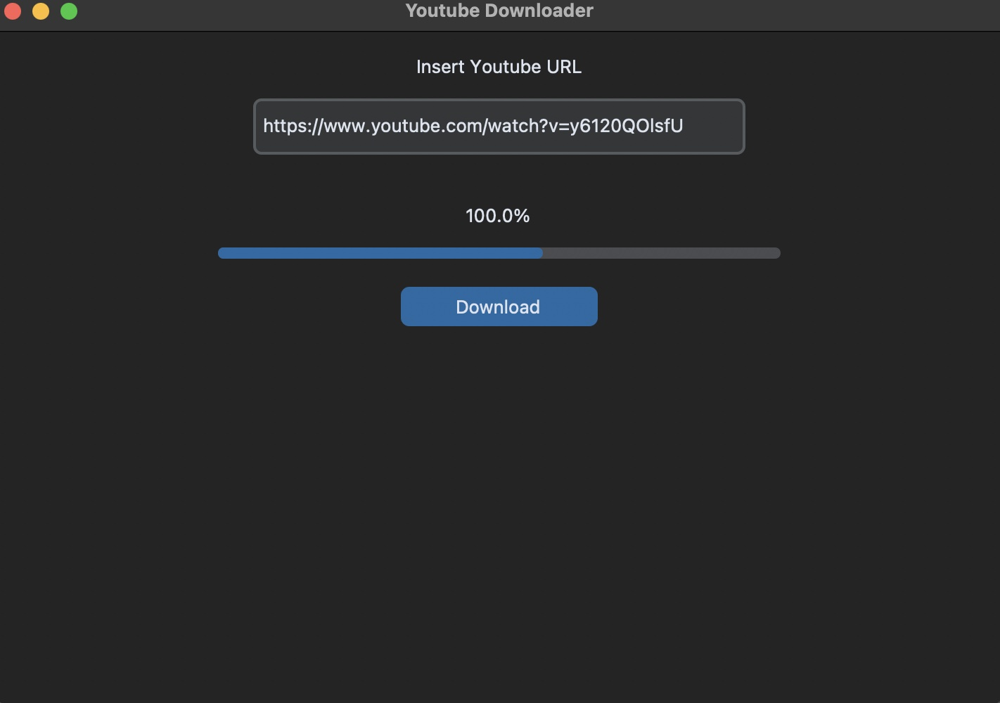
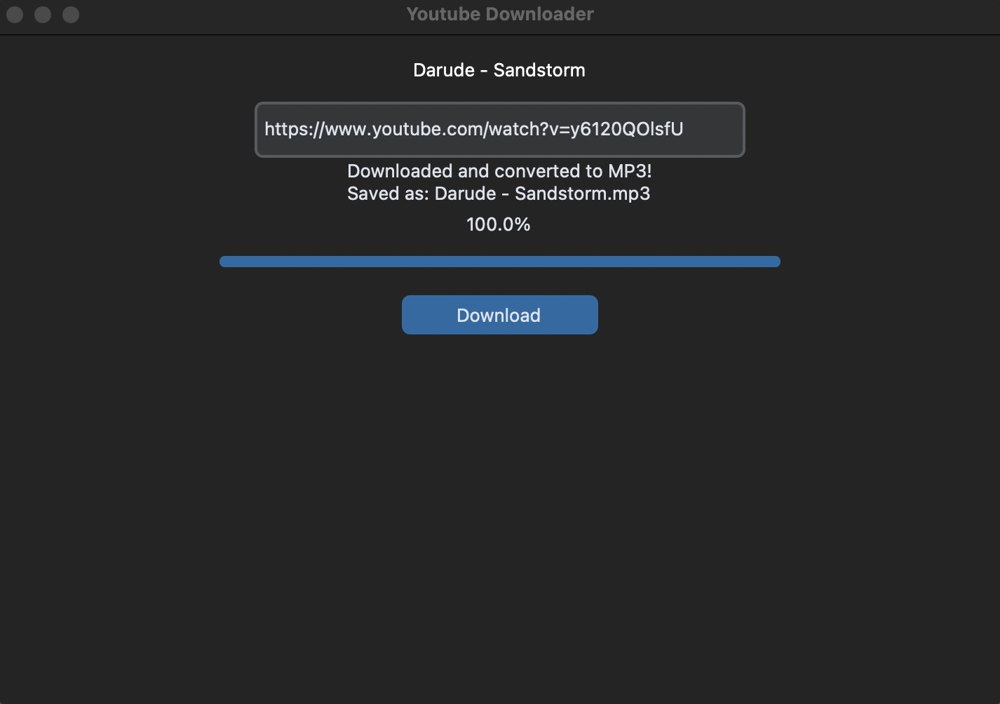

# Youtube to mp3 converter

## Overview

The YouTube to MP3 Converter is a Python-based graphical application that allows users to download YouTube videos as MP3 files and optionally add them to their Spotify playlists. The application uses yt-dlp for downloading YouTube videos and Spotify API integration for managing playlists. The graphical interface is built with customtkinter, providing a sleek, modern UI. The app is designed to be user-friendly and offers real-time progress updates during the download process.

This tool is cross-platform, running on Windows, macOS, and Linux. You can follow the instructions in the “How to run” section to set up and start the program.

## Purpose

The application was built to make it easier to convert YouTube videos into MP3 format and integrate them directly into Spotify playlists. This is useful for users who want to quickly add YouTube music tracks to their Spotify account, utilizing both the yt-dlp for downloading and Spotipy for the Spotify integration. The app was also a fun exploration into using customtkinter to design a more modern graphical user interface.

Click the link below to see the customtkinter repo for yourself:

[CustomTkinter Repo](https://github.com/TomSchimansky/CustomTkinter)

## User interface

    
    

## Features

- YouTube to MP3 Download: Users can input a YouTube video URL, and the app will download the audio in MP3 format using yt-dlp. The downloaded MP3 is saved to the user’s local music directory.
  
- Spotify Integration: The app connects to the user’s Spotify account through the Spotify API, allowing users to search for the downloaded song on Spotify and add it to their Spotify playlists.
  
- Song Matching via Fuzzy Search: After downloading the MP3, the app tries to match the song with a Spotify track using fuzzy string matching to find the closest match based on the song title and artist.
  
- Playlist Management: Once connected to Spotify, the user can choose a playlist from their Spotify account and add the downloaded track directly to that playlist.
  
- Real-Time Progress Display: A progress bar and percentage display keep users informed of the download status as the YouTube video is being converted into an MP3 file.
  
- Modern UI with customtkinter: The app features a modern user interface using customtkinter, which offers a more polished and customizable alternative to traditional tkinter interfaces.
  
- Cross-Platform: The application is compatible with Windows, macOS, and Linux.

---
## How to run

For detailed instructions on running the app, please refer to the [Run Guide](/guides/run-app.md).

## Setup

For setting up the dependencies and configuring the Spotify API, follow the steps in the [Setup Guide](/guides/setup-guide.md).

## LICENSE

Distributed under the MIT License. See [LICENSE](LICENSE) for more information.